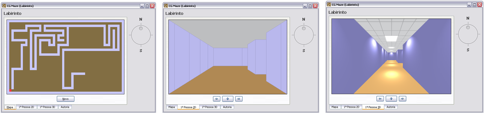
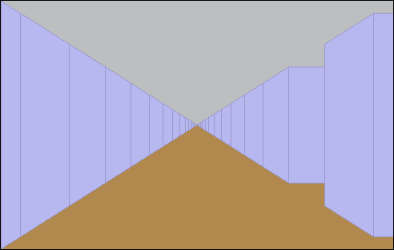
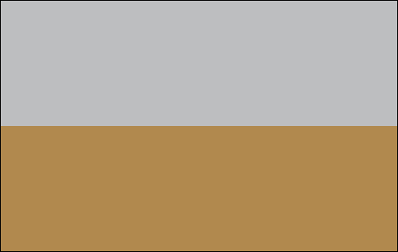
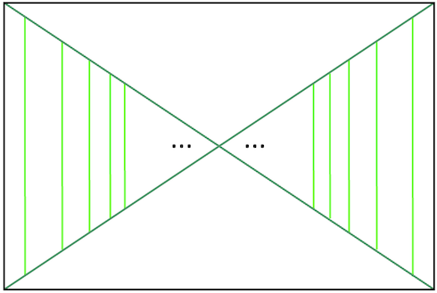
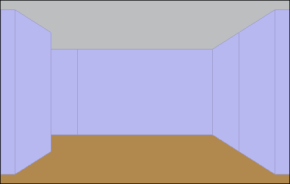
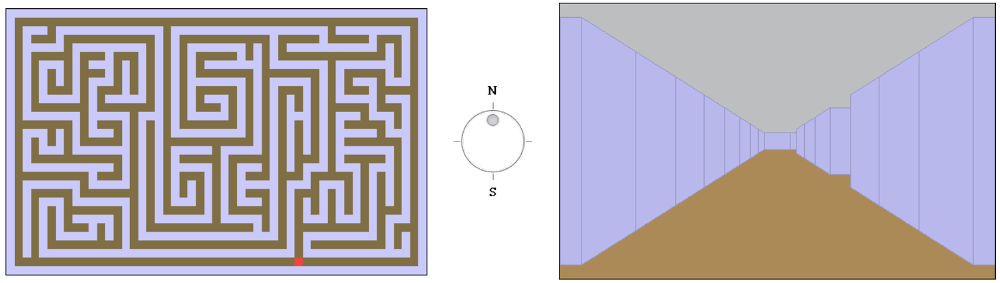
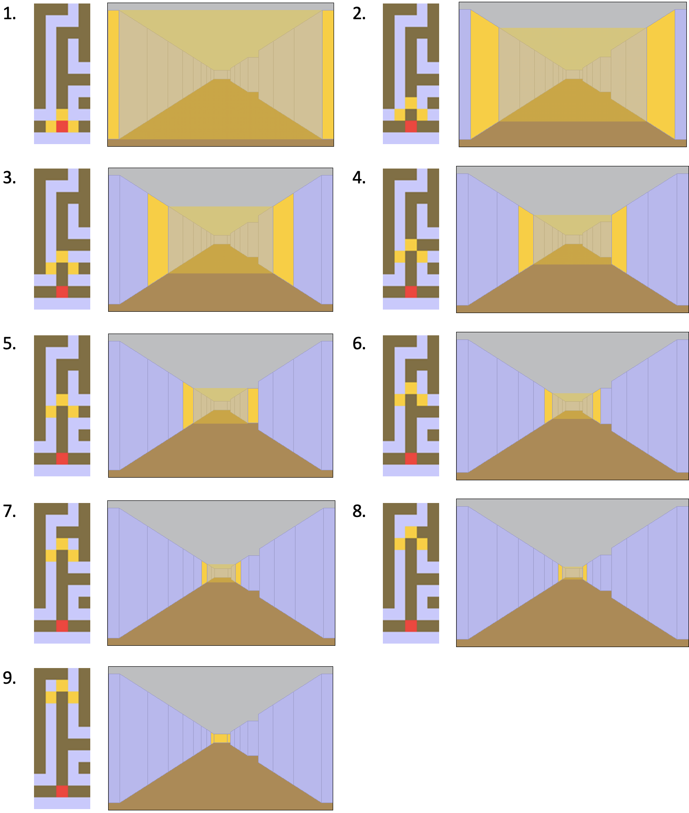
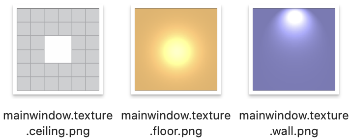
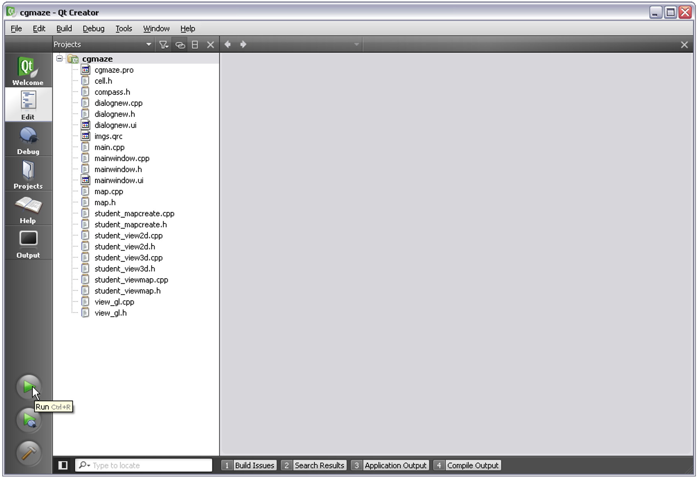

# Computer Graphics Maze

**Author: Pedro Freire - www.pedrofreire.com**

## The Game

CG-Maze is a Computer Graphics (OpenGL) demo application that allows the user to navigate a randomly-generated maze in the first person. It does this in two separate viewports:

* One drawn using simple 2D techniques specialized for this particular use-case.
* Another drawn with a similar technique, but using real OpenGL primitives for the best aspect ratios, motion smoothness and visual quality.

The "game" has no other challenge or goal. It's meant as a demo and was used as a teaching tool for a Computer Graphics university course.

## 2D Algorithm

Let's take this maze view as a starting example:

The sky and "floor" are always the same colour, so we start by drawing them.

On top of them we'll start drawing the walls.

Note how for a first-person view inside a maze, the edges of the walls always form a cross.

However, we can't start drawing this immediately, as the cross can be painted over by a wall, as in this example.

Instead, we'll start at the closest position of the maze near the player, and move forwards, one maze coordinate at a time, until we find a wall in front of the path. In the example above, we found a wall after moving forward three maze coordinates.

Let's look at an example. Say we want to draw this view.

We will draw each yellow wall shown in the following steps.

Note how in each step, the yellow figures that are drawn are either:

* Squares
* Isosceles trapezoids - i.e., squares with two sides streched vertically.

All we need to do now is make some 2D calculations where the (x,y) coordinates of each wall edge move to, as we move down the maze path, to draw the entire view.

## 3D Algorithm

The 3D algorithm is similar to the technique used for 2D, to avoid just pushing the entire maze to OpenGL, on each frame.

There are a few large differences, though:

* We no longer think of a planar screen and (x,y) coordinates there, but we think of the actual 3D maze and its (x,y,z) coordinates. Those are the ones pushed to OpenGL, and with the correct positioning of the camera (player), OpenGL handles the rest.
* Given all maze coordinates are squares, and OpenGL does the remaining coordinate translation to the screen, we also draw the ceiling and floor on each step.
* Given that it's just as easy to fill OpenGL surfaces with a flat color or an image, we use pre-drawn images to illustrate and simulate lights.
* Besides drawing all the walls of the path in front of the player, we also draw all walls on each path on both sides of the user. This allows the viewing window to be resized very wide and display the periphery walls correctly, and also allows the animations of rotation to work correctly.

These are the images (textures) used to draw walls, ceiling and floor.

## Compiling and Running

The source code was based on Qt4. [Qt is now in version 6](https://www.qt.io/product/development-tools) and can be downloaded with a 10-day free trial (Jan 2025).

Start Qt Creator. Pick File then "Open File or Project":

Open `src/cgmaze.pro`. That's the project file for CG-Maze.

Now, with the opened project, click "Play" at the bottom of the screen to compile (build) and run your project.

## Jan 2025 Notes

This code was initially written in 2010 as a project inception for my Computer Graphics taught classes.